# Study Space System Flowchart

## System Overview

```mermaid
graph TD
    A[🚀 Study Space Application] --> B[🔐 Authentication System]
    A --> C[📱 Main Application Interface]
    A --> D[🤖 AI Document Processing]
    A --> E[🗄️ Database Management]
    
    B --> B1[👤 User Registration]
    B --> B2[🔑 User Login]
    B --> B3[🛡️ Session Management]
    B --> B4[🚪 User Logout]
    
    C --> C1[📚 Study Modules]
    C1 --> C2[🃏 AI Flashcards]
    C1 --> C3[📝 Smart Notes]
    C1 --> C4[✅ Interactive Quizzes]
    C1 --> C5[📋 Task Management]
    C1 --> C6[🎮 Snake Game]
    
    D --> D1[📁 Document Upload]
    D --> D2[🤖 AI Content Generation]
    D --> D3[📊 Content Processing]
    D --> D4[💾 Database Storage]
    
    E --> E1[👤 User Data]
    E --> E2[📄 User Notes]
    E --> E3[🃏 User Flashcards]
    E --> E4[❓ User Quizzes]
    E --> E5[📋 User Tasks]
    
    style A fill:#8b5cf6,stroke:#7c3aed,stroke-width:3px,color:#fff
    style B fill:#ef4444,stroke:#dc2626,stroke-width:3px,color:#fff
    style C fill:#3b82f6,stroke:#2563eb,stroke-width:3px,color:#fff
    style D fill:#10b981,stroke:#059669,stroke-width:3px,color:#fff
    style E fill:#f59e0b,stroke:#d97706,stroke-width:3px,color:#fff
```

## Authentication Flow

```mermaid
graph TD
    A[🚀 Study Space Launch] --> B{User Status}
    B -->|New User| C[👤 User Registration]
    B -->|Existing User| D[🔑 User Login]
    B -->|Guest| E[📱 Guest Mode]
    
    C --> C1[📧 Email Validation]
    C --> C2[🔑 Password Creation]
    C --> C3[👤 Profile Setup]
    C --> C4[✅ Account Creation]
    
    D --> D1[📧 Email Input]
    D --> D2[🔑 Password Verification]
    D --> D3{Authentication}
    D3 -->|Success| F[🏠 Main Dashboard]
    D3 -->|Failure| G[❌ Login Error]
    
    E --> H[📱 Limited Access]
    H --> I[🔐 Prompt for Registration]
    
    F --> J[🛡️ Session Management]
    J --> K[⏰ Auto Logout Timer]
    J --> L[🔄 Session Refresh]
    
    G --> M[🔄 Retry Login]
    M --> D
    
    style A fill:#8b5cf6,stroke:#7c3aed,stroke-width:3px,color:#fff
    style F fill:#10b981,stroke:#059669,stroke-width:3px,color:#fff
    style G fill:#ef4444,stroke:#dc2626,stroke-width:3px,color:#fff
```

## AI Document Processing

```mermaid
graph TD
    A[📁 Document Upload] --> B[🔍 File Type Detection]
    B --> C{Supported Format?}
    C -->|Yes| D[📄 Content Extraction]
    C -->|No| E[❌ Unsupported Format Error]
    
    D --> F[📝 Text Processing]
    F --> G[🤖 AI Model Processing]
    G --> H[🧠 Qwen3-coder LLM]
    
    H --> I[📊 Content Analysis]
    I --> J[📚 Study Notes Generation]
    I --> K[🃏 Flashcard Creation]
    I --> L[❓ Quiz Generation]
    
    J --> M[📋 Structured Notes]
    K --> N[🃏 Question-Answer Pairs]
    L --> O[❓ Multiple Choice Questions]
    
    M --> P[💾 Database Storage]
    N --> P
    O --> P
    
    P --> Q[✅ Content Available to User]
    
    R[⚙️ AI Configuration] --> H
    S[🔧 Error Handling] --> T[📊 Fallback Content Generation]
    
    style A fill:#8b5cf6,stroke:#7c3aed,stroke-width:3px,color:#fff
    style H fill:#10b981,stroke:#059669,stroke-width:3px,color:#fff
    style Q fill:#3b82f6,stroke:#2563eb,stroke-width:3px,color:#fff
```

## Database Architecture

```mermaid
graph TD
    A[🗄️ MySQL Database Schema] --> B[👤 Core Tables]
    A --> C[📚 Content Tables]
    A --> D[🔗 Relationship Tables]
    A --> E[📊 Tracking Tables]
    
    B --> B1[👤 users<br/>id, full_name, email, password<br/>created_at, last_login_at<br/>current_streak, total_study_hours]
    
    C --> C1[📄 notes<br/>id, user_id, title, content<br/>category, created_at, updated_at, is_pinned]
    C --> C2[🃏 flashcard_decks<br/>id, user_id, title, description<br/>subject, difficulty, created_at, last_studied, study_count]
    C --> C3[🃏 flashcards<br/>id, deck_id, question, answer<br/>difficulty, created_at, last_studied, study_count, is_mastered]
    C --> C4[❓ quizzes<br/>id, user_id, title, description<br/>difficulty, best_score, times_taken, last_taken]
    C --> C5[❓ questions<br/>id, quiz_id, question_text, options<br/>correct_answer, explanation]
    C --> C6[📋 todo_items<br/>id, user_id, title, description<br/>priority, due_date, is_completed, created_at]
    C --> C7[📁 user_files<br/>id, user_id, file_name, file_path<br/>file_type, file_size, created_at]
    
    D --> D1[🔗 Foreign Key Constraints]
    D1 --> D2[user_id → users.id]
    D1 --> D3[deck_id → flashcard_decks.id]
    D1 --> D4[quiz_id → quizzes.id]
    
    E --> E1[📊 activities<br/>id, user_id, activity_type<br/>description, timestamp]
    
    F[🛡️ User Isolation] --> G[📊 All Queries Filter by user_id]
    G --> H[🔒 Complete Data Privacy]
    
    I[🗑️ Cascade Deletion] --> J[👤 User Deletion Triggers]
    J --> K[🔄 Automatic Data Cleanup]
    
    style A fill:#8b5cf6,stroke:#7c3aed,stroke-width:3px,color:#fff
    style H fill:#10b981,stroke:#059669,stroke-width:3px,color:#fff
    style K fill:#ef4444,stroke:#dc2626,stroke-width:3px,color:#fff
```

## Component Architecture

```mermaid
graph TD
    A[🏗️ Study Space Architecture] --> B[📱 Presentation Layer]
    A --> C[🎯 Business Logic Layer]
    A --> D[💾 Data Access Layer]
    A --> E[🤖 AI Processing Layer]
    A --> F[🗄️ Database Layer]
    
    B --> B1[🔐 AuthView.java]
    B --> B2[📱 SidebarView.java]
    B --> B3[🃏 FlashcardListView.java]
    B --> B4[📝 NotesView.java]
    B --> B5[✅ QuizListView.java]
    B --> B6[📋 TodoListView.java]
    B --> B7[🎮 SnakeGameView.java]
    B --> B8[👤 ProfileSettingsView.java]
    
    C --> C1[🎯 AuthController.java]
    C --> C2[🔄 SceneManager.java]
    C --> C3[🛠️ IconUtils.java]
    C --> C4[📤 DocumentProcessingService.java]
    C --> C5[📊 QuizGenerationService.java]
    
    D --> D1[💾 MySQLDataStore.java]
    D --> D2[🗄️ DatabaseConnection.java]
    D --> D3[📊 DataStore.java]
    
    E --> E1[🐍 Python Flask API]
    E --> E2[🤖 document_processor.py]
    E --> E3[🧠 Qwen3-coder LLM]
    E --> E4[📄 PyPDF2, python-docx, python-pptx]
    
    F --> F1[🗄️ MySQL Database]
    F --> F2[👤 users table]
    F --> F3[📄 notes table]
    F --> F4[🃏 flashcard_decks table]
    F --> F5[🃏 flashcards table]
    F --> F6[❓ quizzes table]
    F --> F7[❓ questions table]
    F --> F8[📋 todo_items table]
    F --> F9[📁 user_files table]
    F --> F10[📊 activities table]
    
    style A fill:#8b5cf6,stroke:#7c3aed,stroke-width:3px,color:#fff
    style B fill:#3b82f6,stroke:#2563eb,stroke-width:3px,color:#fff
    style C fill:#ef4444,stroke:#dc2626,stroke-width:3px,color:#fff
    style D fill:#10b981,stroke:#059669,stroke-width:3px,color:#fff
    style E fill:#f59e0b,stroke:#d97706,stroke-width:3px,color:#fff
    style F fill:#06b6d4,stroke:#0891b2,stroke-width:3px,color:#fff
```

## Feature Modules

```mermaid
graph TD
    A[🎯 Study Space Features] --> B[🔐 Authentication System]
    A --> C[📚 Study Tools]
    A --> D[🤖 AI Processing]
    A --> E[🎮 Interactive Features]
    A --> F[📊 Progress Tracking]
    
    B --> B1[👤 User Registration]
    B --> B2[🔑 Secure Login]
    B --> B3[🛡️ Session Management]
    B --> B4[👤 Profile Management]
    
    C --> C1[🃏 AI Flashcards]
    C --> C2[📝 Smart Notes]
    C --> C3[✅ Interactive Quizzes]
    C --> C4[📋 Task Management]
    
    C1 --> C1A[🤖 AI-Generated Flashcards]
    C1 --> C1B[📚 Custom Flashcard Decks]
    C1 --> C1C[🎯 Study Sessions]
    
    C2 --> C2A[🤖 AI-Generated Notes]
    C2 --> C2B[📝 Rich Text Editor]
    C2 --> C2C[🏷️ Category System]
    
    C3 --> C3A[🤖 AI-Generated Quizzes]
    C3 --> C3B[❓ Multiple Choice]
    C3 --> C3C[⏱️ Time Limits]
    C3 --> C3D[📊 Score Tracking]
    
    C4 --> C4A[📋 Priority System]
    C4 --> C4B[📅 Due Dates]
    C4 --> C4C[📊 Completion Stats]
    
    D --> D1[📁 Document Upload]
    D --> D2[🤖 Content Generation]
    D --> D3[📊 Smart Categorization]
    
    E --> E1[🐍 Snake Game]
    E --> E2[🎯 Break Activities]
    E --> E3[🏆 Achievement System]
    
    F --> F1[📊 Activity Logging]
    F --> F2[📈 User Statistics]
    F --> F3[🎯 Weekly Goals]
    F --> F4[📊 Performance Metrics]
    
    style A fill:#8b5cf6,stroke:#7c3aed,stroke-width:3px,color:#fff
    style B fill:#ef4444,stroke:#dc2626,stroke-width:3px,color:#fff
    style C fill:#3b82f6,stroke:#2563eb,stroke-width:3px,color:#fff
    style D fill:#10b981,stroke:#059669,stroke-width:3px,color:#fff
    style E fill:#f59e0b,stroke:#d97706,stroke-width:3px,color:#fff
    style F fill:#06b6d4,stroke:#0891b2,stroke-width:3px,color:#fff
```

## User Isolation

```mermaid
graph TD
    A[👤 User Login] --> B[🛡️ User Session Created]
    B --> C[🔐 User ID Authentication]
    C --> D[📊 User-Specific Data Access]
    
    D --> E[📄 User Notes]
    D --> F[🃏 User Flashcards]
    D --> G[❓ User Quizzes]
    D --> H[📋 User Tasks]
    D --> I[📁 User Files]
    
    E --> J[🗄️ MySQL Database]
    F --> J
    G --> J
    H --> J
    I --> J
    
    J --> K[🔍 Database Queries with User ID Filter]
    K --> L[📊 User-Specific Results]
    L --> M[🛡️ Data Isolation Maintained]
    
    N[👤 Other Users] --> O[🚫 No Access to User Data]
    O --> P[🛡️ Complete Isolation]
    
    Q[🗑️ User Account Deletion] --> R[🔄 Cascade Delete All User Data]
    R --> S[✅ Complete Data Removal]
    
    style A fill:#8b5cf6,stroke:#7c3aed,stroke-width:3px,color:#fff
    style M fill:#10b981,stroke:#059669,stroke-width:3px,color:#fff
    style P fill:#ef4444,stroke:#dc2626,stroke-width:3px,color:#fff
```

## Data Flow

```mermaid
graph TD
    A[👤 User Action] --> B[📱 JavaFX Interface]
    B --> C[🎯 Business Logic Layer]
    C --> D[💾 Data Access Layer]
    D --> E[🗄️ MySQL Database]
    
    E --> F[📊 Query Results]
    F --> G[🔄 Data Processing]
    G --> H[📱 UI Update]
    H --> I[👤 User Feedback]
    
    J[📁 Document Upload] --> K[🐍 Python Flask API]
    K --> L[🤖 AI Processing]
    L --> M[📊 Generated Content]
    M --> N[💾 Database Storage]
    N --> O[📱 JavaFX Update]
    
    P[🔄 Real-time Updates] --> Q[📊 Global Refresh System]
    Q --> R[🔄 UI Synchronization]
    R --> S[📱 Live Data Display]
    
    T[⚙️ Configuration] --> U[📄 Config Files]
    U --> V[🔧 System Settings]
    V --> W[📊 Runtime Behavior]
    
    style A fill:#8b5cf6,stroke:#7c3aed,stroke-width:3px,color:#fff
    style E fill:#10b981,stroke:#059669,stroke-width:3px,color:#fff
    style L fill:#f59e0b,stroke:#d97706,stroke-width:3px,color:#fff
```

